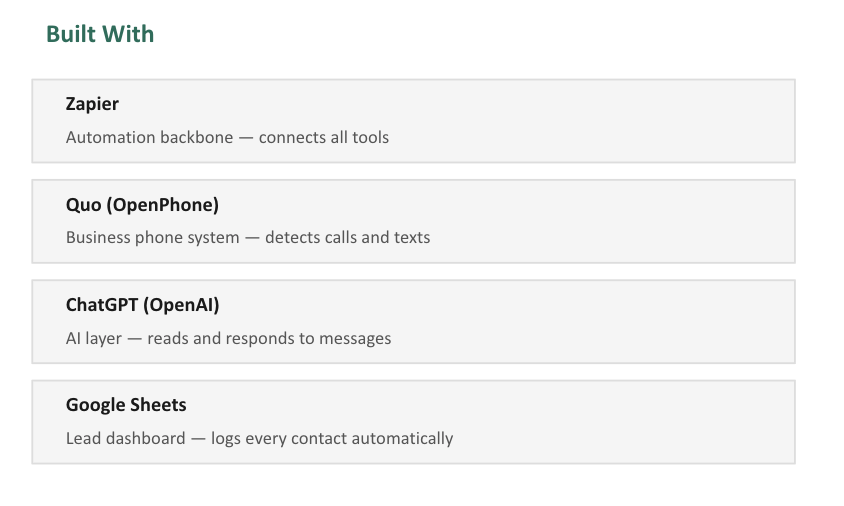

# AI-Assisted Customer Capture System for Service Businesses

An automated customer capture workflow designed to help service businesses respond to missed calls and texts, engage potential customers, and organize inbound leads for follow-up.

---

Core components include:

* Missed call detection
* Automated SMS follow-up
* AI-assisted customer responses
* Lead logging
* Owner notifications
* Basic CRM integration

This project was built as a proof of concept to explore how AI and automation can help service businesses capture opportunities that would otherwise be lost when business owners are busy, unavailable, or unable to respond immediately.

---

## Background

While speaking with local contractors I work with in my real estate business, I noticed a common pattern: many contractors spend most of their day performing the actual work, leaving little time to manage incoming calls, texts, and customer inquiries.

When a call is missed, the opportunity often disappears. Potential customers move on to the next contractor before receiving a response.

I wanted to explore whether a lightweight AI-assisted workflow could help bridge that gap by responding immediately, collecting customer information, and organizing conversations for later follow-up.

---

## Problem

Many service businesses rely heavily on the owner's phone as the primary operating system for the company.

This creates several operational challenges:

* Missed calls become missed opportunities
* Missed texts go unanswered
* Customer information becomes difficult to organize
* Follow-up activity is inconsistent
* Conversations are spread across multiple channels
* Potential customers are lost before contact is made

As the business grows, these inefficiencies become increasingly difficult to manage manually.

---

## System Overview

The current workflow operates as follows:

Customer Calls

↓

Missed Call Detected

↓

Automatic SMS Response

↓

Customer Replies

↓

AI-Assisted Response

↓

Lead Logged

↓

Owner Notification

↓

Personal Follow-Up

---

## Screenshots

### Customer Capture Workflow

### CRM Lead Log

### Technology Stack

---

## Lessons Learned

One of the biggest takeaways from building this system was realizing that many small businesses do not necessarily need more leads.

They often need better systems for capturing, organizing, and responding to the leads they already receive.

The challenge is frequently operational rather than marketing-related.

---

## Future Roadmap

Future versions may include:

* Customer retention workflows
* Review request automation
* Maintenance reminders
* Lead prioritization
* Multi-agent customer intake
* Revenue opportunity tracking
* Expanded CRM automation

* ## Repository Contents

* Executive Summary
* Detailed Case Study
* Client Presentation Deck
* CRM Example
* Lead Log Example
* Workflow Documentation
* Zapier Workflow Exports
